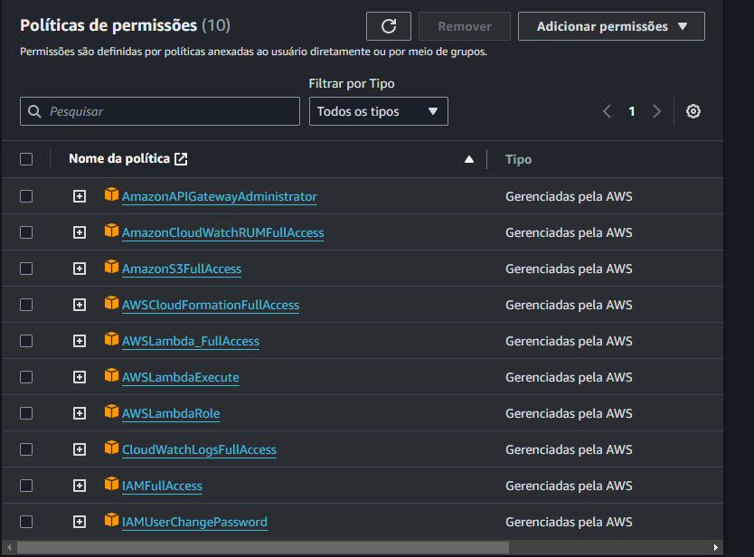

## Run Local Nest
```bash
# install deps
$ npm i

# change NODE_ENV to "dev" and execute
$ npm run start:dev
```

## Run Local Serverless Offline
```bash
# install deps
$ npm i

# build webpack
$ npm run build:webpack

# change NODE_ENV to "prod" and execute
$ npm run start:sls
```

## AWS Config
```bash
# configure aws provider
$ serverless config credentials --provider aws --key API_KEY --secret SECRET_KEY
```

## AWS Permissions


# Deploy Serverless

```bash
# build
$ npm i

# build
$ npm run build:webpack

# deploy
$ npm run sls:deploy
```

## License

Nest is [MIT licensed](LICENSE).